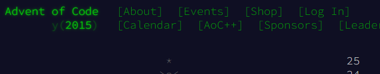

# Advent of Code



## Every Puzzle

Having only discovered AoC in 2022, could not resist doing the back catalog.

First attempts in 2022 involved using all the help I could get from 3rd party
packages such as numpy and networkx.

This repository is an attempt to undertake the back catalog by just using python
3.11 without any extra packages.

## Coding Template

There is a template `day_.py` which has 3 functions

`parse_data`, `solve_part_a`, `solve_part_b`

`parse_data`: is for handling the input and converting it to some
useful data structure. 

`solve_part_`: is wrapped with a decorator `@aoc_part` which
will output some simple stats like execution time etc. along with the result

## Puzzle Data

Due to AoC intellectual property rights I have not included the example or my
data in the repo. If you like create a `.env` in the root with an environment
variable.

`AOC_DATA_PATH=<path to your data>`

The folder structure expected within it is year/day_nn and within the day folder
usually 2 files for the example and your data which should be named `ex.txt` and
`my.txt`

```text
data-root
├───2015
│   ├───day_01
│   ├───day_02
│   ├───day_03
```
